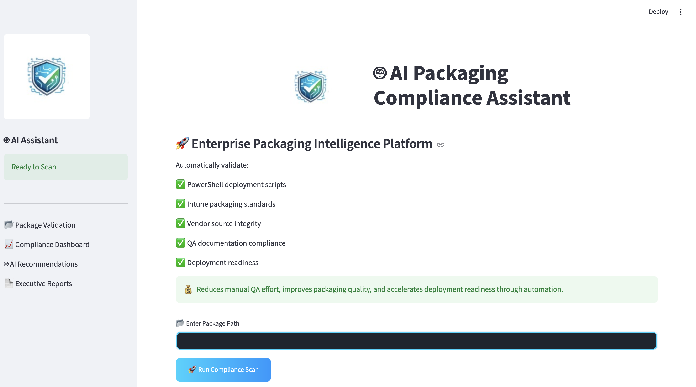
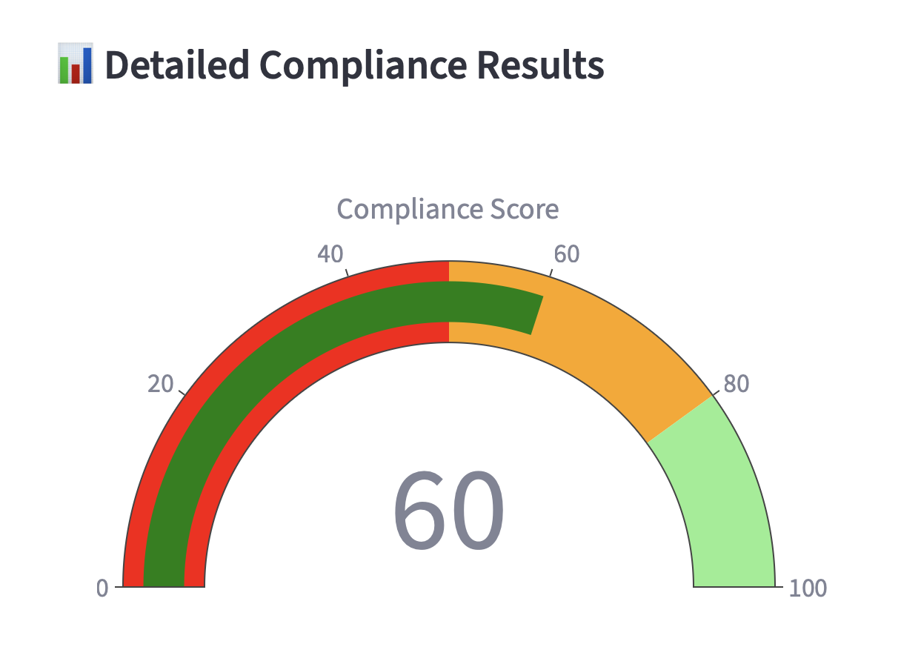
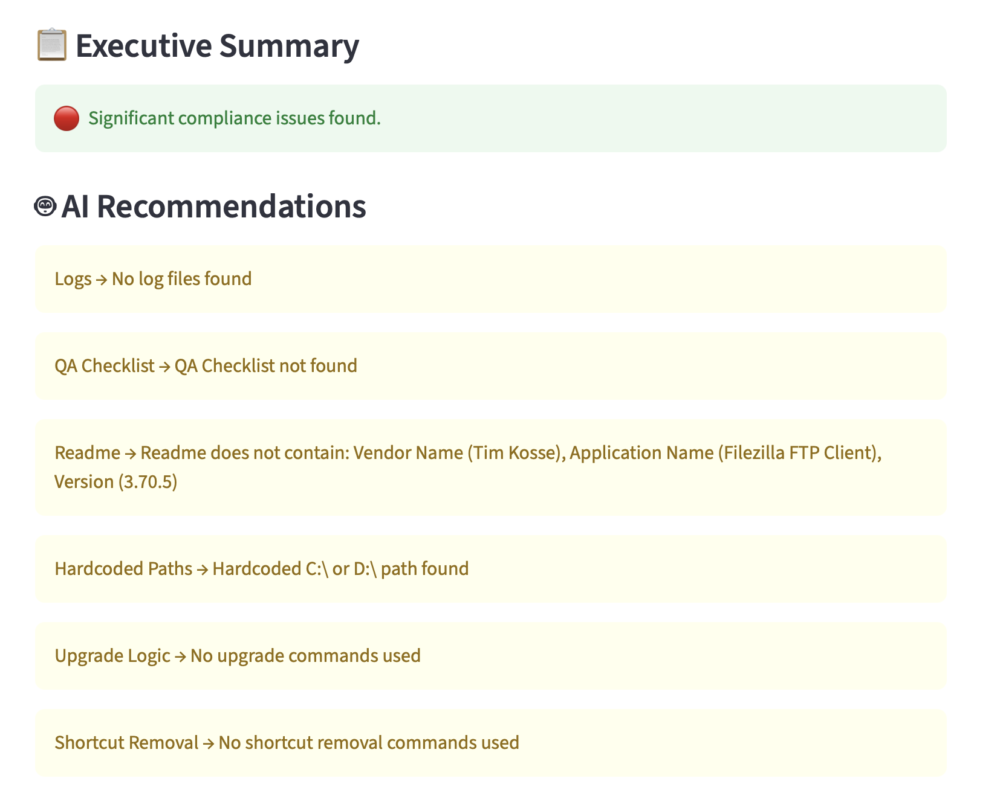
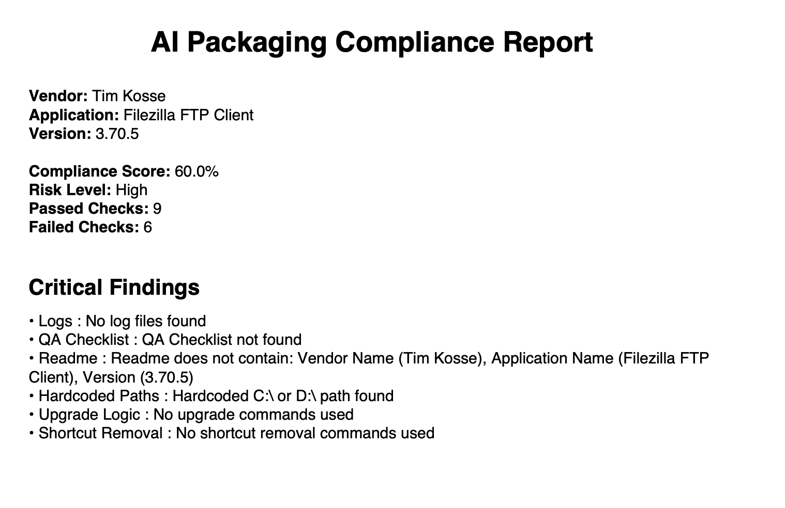

# 🤖 AI Packaging Compliance Assistant

An AI-powered enterprise software packaging validation platform that automates compliance checks, deployment readiness assessment, risk analysis, executive reporting, and packaging quality validation.

---

## 🚀 Overview

AI Packaging Compliance Assistant helps Application Packaging Engineers validate software packages against enterprise packaging standards.

The platform automatically scans packaging folders, PowerShell deployment scripts, Intune packages, vendor source files, and documentation to identify compliance issues before deployment.

---

## ✨ Features

### 📦 Package Validation
- Naming standard verification
- Vendor source validation
- Package folder validation
- Intune package verification
- Document folder validation

### 🔍 Compliance Checks
- QA Checklist verification
- Readme validation
- Log file validation
- Deployment readiness checks
- Source cleanup validation

### 🧠 AI Recommendations
- Automatic issue detection
- Risk assessment
- Remediation suggestions
- Executive summaries

### 📊 Reporting
- Compliance score dashboard
- Risk level assessment
- Executive summary report
- PDF report generation
- Detailed compliance results

---

## 🏗️ Architecture

```text
Package Folder
      │
      ▼
Compliance Scanner
      │
      ├── Folder Checks
      ├── Document Checks
      ├── Intune Checks
      ├── PSADT Checks
      └── Vendor Source Checks
      │
      ▼
Compliance Engine
      │
      ▼
Risk Assessment
      │
      ▼
Executive Report
```

## 📂 Project Structure

```text
AI-Packaging-Compliance-Assistant/
│
├── app.py
├── requirements.txt
├── README.md
│
├── assets/
│   └── logo.png
│
├── checks/
│   ├── __init__.py
│   ├── folder_checks.py
│   ├── document_checks.py
│   ├── intune_checks.py
│   ├── psadt_checks.py
│   └── vendor_source_checks.py
│
└── screenshots/
    ├── home_page.png
    ├── compliance_dashboard.png
    ├── executive_summary.png
    └── pdf_report.png
```

---

## 🖼️ Screenshots

### Home Page



### Compliance Dashboard



### Executive Summary



### PDF Report



---

## ⚙️ Installation

Clone the repository:

```bash
git clone https://github.com/anjalinimje/ai-packaging-compliance-assistant.git
cd ai-packaging-compliance-assistant
```

Create virtual environment:

```bash
python3 -m venv .venv
source .venv/bin/activate
```

Install dependencies:

```bash
pip install -r requirements.txt
```

---

## ▶️ Run Application

```bash
streamlit run app.py
```

Application will launch at:

```text
http://localhost:8501
```

---

## 📈 Business Impact

- Reduces manual QA effort
- Improves packaging quality
- Standardizes compliance validation
- Accelerates deployment readiness
- Reduces production deployment risks
- Generates executive-ready reports

---

## 🛠️ Technology Stack

- Python
- Streamlit
- Pandas
- Plotly
- ReportLab
- OpenPyXL

---

## 👩‍💻 Author

**Anjali Nimje**

AI/ML Enthusiast

---

## 📜 License

MIT License